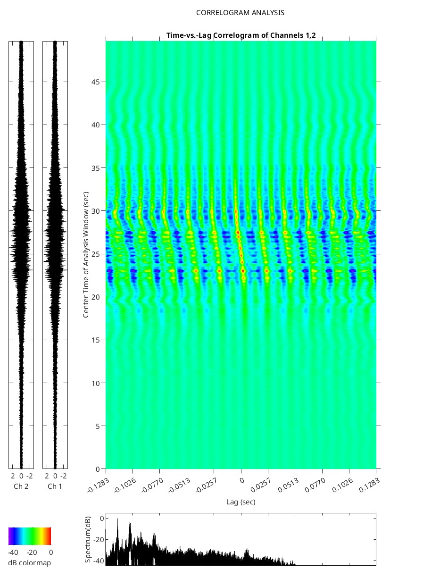
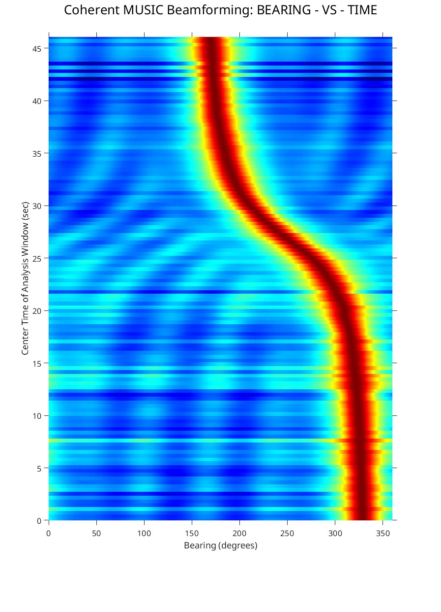

# Acoustic_Array_Processing
Matlab code for processing acoustic circular array data (example included). The following algorithms are included:

```
Array_Data_Load.m
%   Array_Data_Plot.m
%   Array_Data_Listen.m
%   Array_Energy.m
%   Array_Correlation.m
%   Array_Correlogram.m
%   Array_TFA.m
%   Array_Cepstrum.m
%   Array_BeamPatterns.m
%   Array_BTR.m
%   Array_CBF.m
%   Array_MVDR.m
%   Array_Music_coh.m
```





